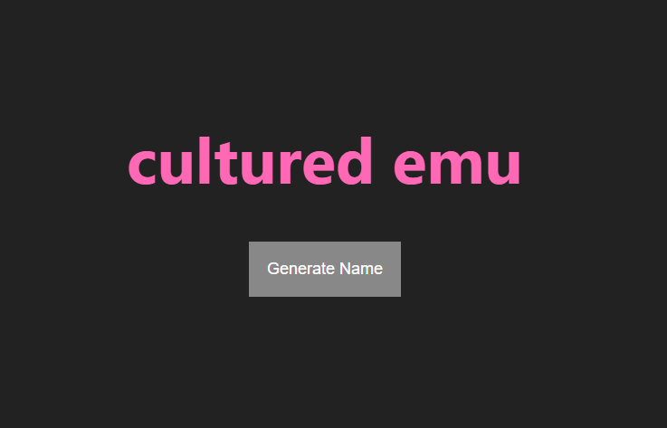

# Band Name Generator

## Backend Challenge

## Description

Backend Application allowing users to generate random band names.

This was a coding challenge presented by [Dr. Angela Yu](https://www.udemy.com/user/4b4368a3-b5c8-4529-aa65-2056ec31f37e/) within her [Udemy Course](https://www.udemy.com/course/the-complete-web-development-bootcamp/).

## Usage

### Step 1

Download Repository and open the project in an Editor of your choice. I recommend VS Code.

<em>DO NOT SAVE THE CODE.</em>
<em>Prettier and other auto-formatting extensions may break the code.</em>

### Step 2

Install dependencies

### Step 3

Run the code using [Nodemon](https://www.youtube.com/watch?v=cYHPNurmXGU).
<em>Credit to redfriends for Nodemon video. This is NOT mine.</em>

### Step 4

Using Chrome go to localhost:3000

### Step 5

Click the <em>Generate Name</em> button and you will be given a random band name.

## Challenge Instructions

### index.js Instructions

Step 1 - Make the get route work and render the index.ejs file.

Step 2 - Make the generate name functionality work
Hint: When the "Generate Name" button in index.ejs is clicked, it should hit up this route.
Then:

1. You should randomly pick an adjective from the const "adj" and a noun from const "noun",
   scroll down to see the two arrays.
2. Send the index.ejs as a response and add the adjective and noun to the res.render
3. Test to make sure that the random words display in the h1 element in index.ejs

Step 3 - Make the styling show up.
Hint 1: CSS files are static files!
Hint 2: The header and footer are partials.
Hint 3: Add the CSS link in header.ejs

Step 4 - Add a dynamic year to the footer.
Hint: Google to find out how to get the current year using JS.

### index.ejs Instructions

Step 2 - If an adjective and noun are sent to this ejs file,
Change the h1 to show the adjective and noun.
But when the user first goes on the website and there is no adjective and noun,
Show the default h1 below -->

Step 3 Add Header

Step 3 Add Footer

### header.ejs Instructions

Add the link to the CSS stylesheet here
Hint: the link is relative to the public folder

### footer.ejs Instructions

Step 4 - Add a dynamic year to the footer using JS.

## About

Hello, my name is David  
You can email me at [dwhipp88@gmail.com](mailto:dwhipp88@gmail.com)  
You can view my [github](https://github.com/D-Whipp).  
Check out my [portfolio](https://splendid-ganache-f82581.netlify.app/).  
Let's make a connection! [LinkedIn](https://www.linkedin.com/in/david-w-079841213/)

## Badges

